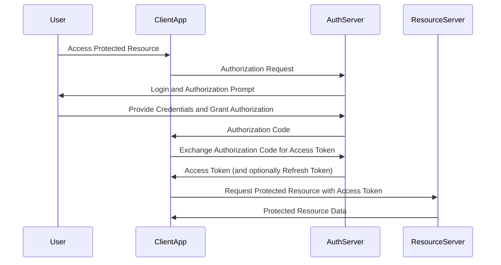

# test

```mermaid
sequenceDiagram
    participant User
    participant ClientApp
    participant AuthServer
    participant ResourceServer

    User->>ClientApp: Access Protected Resource
    ClientApp->>AuthServer: Authorization Request
    AuthServer->>User: Login and Authorization Prompt
    User->>AuthServer: Provide Credentials and Grant Authorization
    AuthServer->>ClientApp: Authorization Code
    ClientApp->>AuthServer: Exchange Authorization Code for Access Token
    AuthServer->>ClientApp: Access Token (and optionally Refresh Token)
    ClientApp->>ResourceServer: Request Protected Resource with Access Token
    ResourceServer->>ClientApp: Protected Resource Data

```
