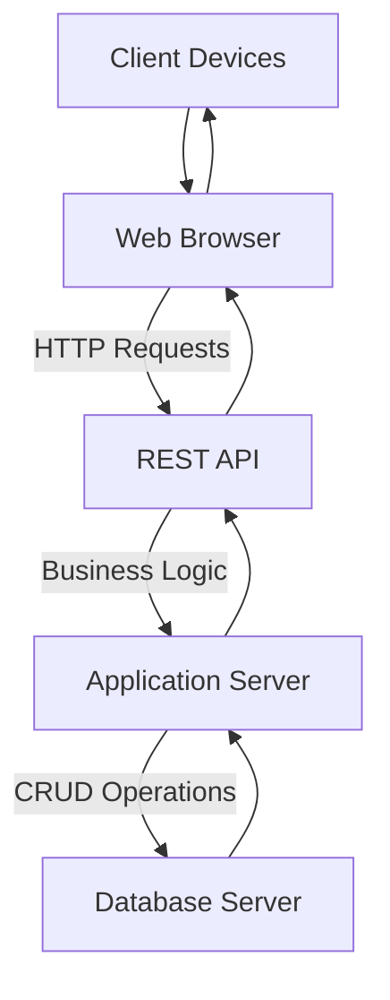

# test

```mermaid
graph TD
    Client[Client Devices]
    Browser[Web Browser]
    API[REST API]
    Server[Application Server]
    DB[Database Server]

    Client --> Browser
    Browser -->|HTTP Requests| API
    API -->|Business Logic| Server
    Server -->|CRUD Operations| DB
    DB --> Server
    Server --> API
    API --> Browser
    Browser --> Client
```
