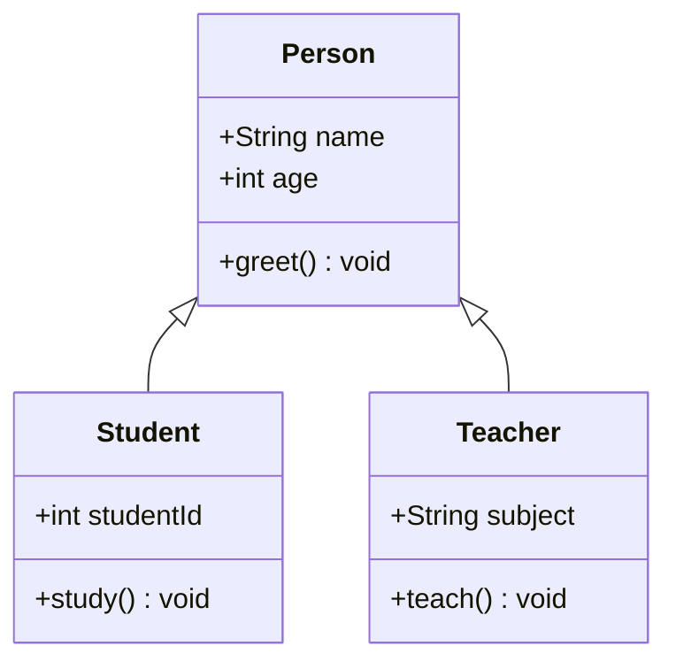

# test

```mermaid
classDiagram
    class Person {
        +String name
        +int age
        +greet() void
    }

    class Student {
        +int studentId
        +study() void
    }

    class Teacher {
        +String subject
        +teach() void
    }

    Person <|-- Student
    Person <|-- Teacher

```
